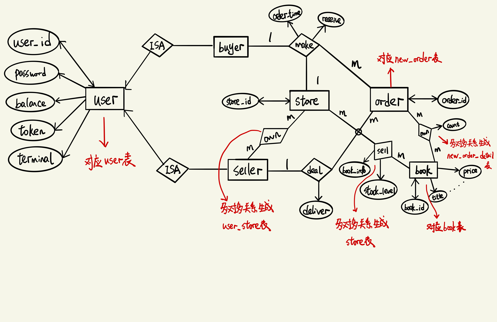
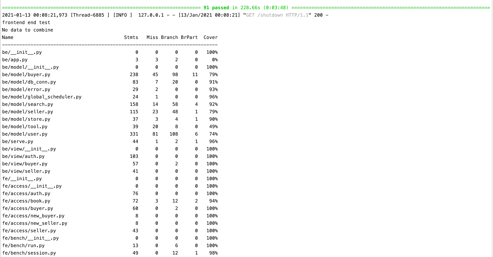
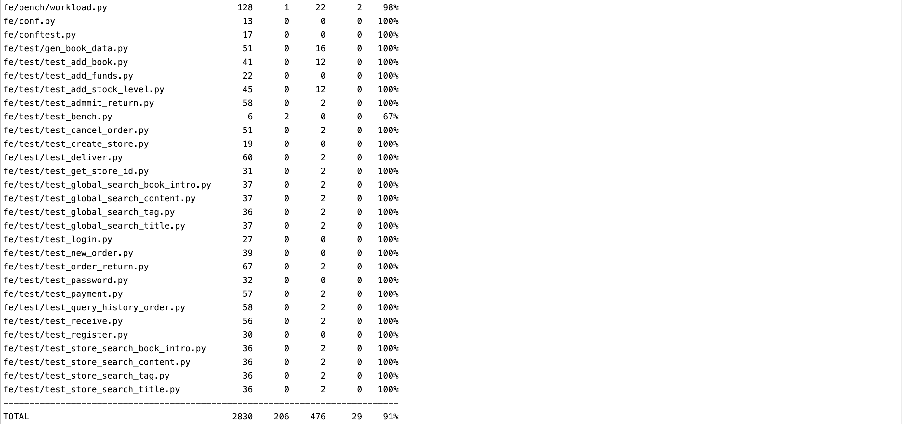
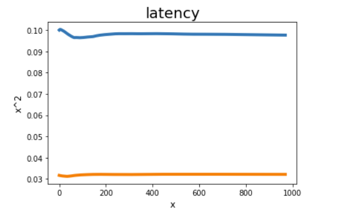
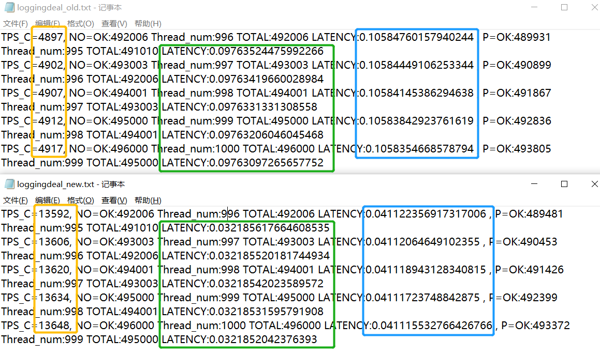
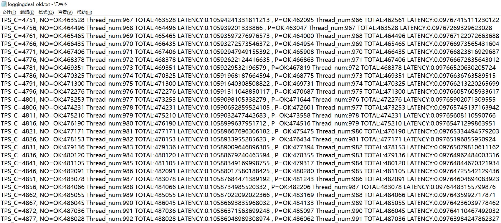
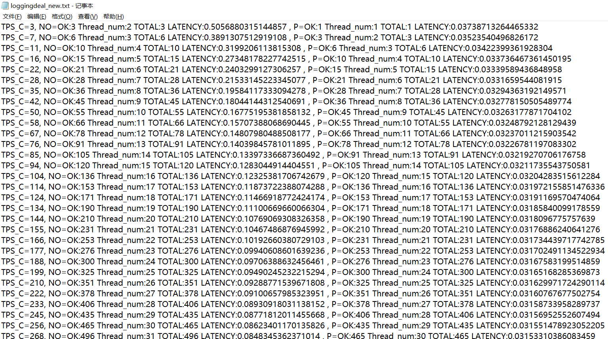
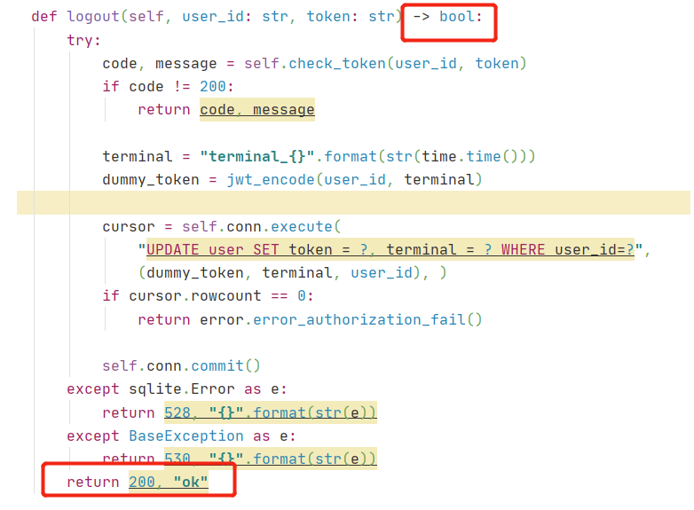
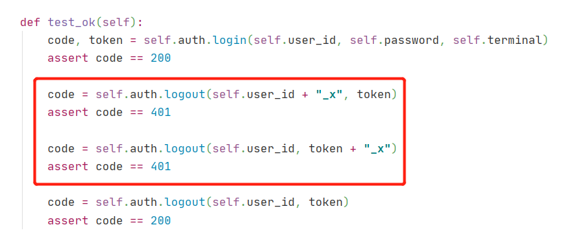

# 华东师范大学数据科学与工程学院实验报告

| 课程名称：当代数据管理系统 | 年级：2018 级                | 上机实践成绩：                              |
| -------------------------- | ---------------------------- | ------------------------------------------- |
| 指导教师：周烜             | 姓名：史浩洋、何佳喧、沈怡琪 | 学号：10183901201、10173901216、10184800428 |
| 上机实践名称： 线上书店    |                              | 上机实践日期：2021/1/12                     |
| 上机实践编号：             | 组号：                       | 上机实践时间：                              |

github 地址：https://github.com/SSH-DBMS-201-1-17-14/bookstore

已完成功能：

1. 100%(60%基础功能+40%扩展功能)

2. 特殊处理以及额外功能：

    1）特殊处理：搜索结果按相关性由高到低排列，按分页数呈现。

3. 加分项：

    1）取消订单（用户主动取消/超时取消）

    2）测试程序提了两个bug

    3）测试通过并且覆盖率为92%    

    4）使用git进行版本控制


### 1 设计条件假定

1. 用户需先进行注册，方能进行登录

2. 用户需先进行注册，方能进行图书搜索

3. 当用户进行搜索时，可能返回大量的结果，通过分页的形式便于用户查看，其中一页设定显示10个结果

4. 当用户通过搜索范围查找时，可能返回店铺中库存为0的书

5. 当用户根据 content、book_intro、title 进行搜索时，可能出现搜索部分内容或者输错的情况，选择返回与搜索内容相关的 book_id

6. 当用户根据 tag 进行搜索时，返回包含所有 tag 的book_id

7. 卖家必须在买家付款之后才可发货

8. 买家必须在卖家发货之后才可收货

9. 买家只可以在付款之前取消订单

10. 买家只可以在付款之后申请退款

    

### 2 数据库设计

#### 2.1 ER图



#### 2.2 关系模式以及索引设计

##### 2.2.1 用户表 user

| user_id | password | balance  | token | terminal |
| ------- | -------- | -------- | ----- | -------- |
| TEXT    | TEXT     | INTEGER  | TEXT  | TEXT     |
| 用户id  | 密码     | 用户余额 | 令牌  | 终端     |

主键：user_id 

在判断是否存在某用户，用户密码是否正确，增减用户余额等操作时都是使用user_id在user表中进行查找，因此使用用户id作为主键；

##### 2.2.2 用户与店铺的所属关系表 - user_store表

| user_id | store_id |
| ------- | -------- |
| TEXT    | TEXT     |
| 用户id  | 店铺id   |

主键：(store_id,user_id)

在每次交易用户进行付款操作，以及检查店铺和用户所属关系等操作时，需要使用store_id和所属用户的user_id在user_store表进行查找，因此使用(store_id,user_id)为主键。

除此之外，单独根据store_id进行查询的情况也较多。例如：用户查询时需要通过店铺查找到卖家再进行交易，即通过store_id查询其对应的user_id。因此在联合主键中将store_id放在user_id之前。

##### 2.2.3 店铺表 - store表

| store_id | book_id | book_info | stock_level |
| -------- | ------- | --------- | ----------- |
| TEXT     | TEXT    | TEXT      | INTEGER     |
| 店铺id   | 书的id  | 书的信息  | 库存数量    |

主键：(store_id, book_id)

用户在店内查询某店铺某书本的信息和库存数量等操作时，需要将根据store_id和对应的book_id在store表中进行查找，因此将(store_id, book_id)设为主键。

除此之外，单独根据store_id进行查询的情况也较多。例如：检查某店铺是否有上架书时，需要根据store_id将book_id取出。因此在联合主键中将store_id放在book_id之前。

##### 2.2.4 新订单表 - new_order表

| order_id | user_id | store_id | pay                                   | deliver                               | receive                               | order_time     | return           | refund           |
| -------- | ------- | -------- | ------------------------------------- | ------------------------------------- | ------------------------------------- | -------------- | ---------------- | ---------------- |
| TEXT     | TEXT    | TEXT     | INTEGER                               | INTEGER                               | INTEGER                               | FLOAT          | INTEGER          | INTEGER          |
| 订单id   | 用户id  | 店铺id   | 用户是否已付款：已付款为1，未付款为0. | 店家是否已发货：已发货为1，未发货为0. | 用户是否已收货：已收货为1，未收货为0. | 订单生成的时间 | 用户是否发起退款 | 卖家是否确认退款 |

主键：order_id

在判断某订单信息（如下订单时间）时，都是使用order_id在new_order表中进行查找，因此使用order_id作为主键。

##### 2.2.5 详情订单表 - new_order_detail表

| order_id | book_id | count    | price    |
| -------- | ------- | -------- | -------- |
| TEXT     | TEXT    | INTEGER  | INTEGER  |
| 订单id   | 书的id  | 购书数量 | 书的单价 |

主键：(order_id, book_id)

详情订单表主要用于根据order_id和book_id得到某订单某本书的数量和单价，因此使用(order_id, book_id)作为联合主键。

##### 2.2.6 书单目录表 - book表

| id     | title | author | publisher | original_title | translator | pub_year | pages   | price   | currency_unit | binding  | isbn         | author_intro | book_intro | content  | tags     | picture |
| ------ | ----- | ------ | --------- | -------------- | ---------- | -------- | ------- | ------- | ------------- | -------- | ------------ | ------------ | ---------- | -------- | -------- | ------- |
| TEXT   | TEXT  | TEXT   | TEXT      | TEXT           | TEXT       | TEXT     | INTEGER | INTEGER | TEXT          | TEXT     | TEXT         | TEXT         | TEXT       | TEXT     | TEXT     | BYTEA   |
| 书的id | 书名  | 作者   | 出版商    | 原书名         | 译者       | 出版时间 | 页数    | 单价    | 单价单位      | 装订版本 | 国际标准书号 | 作者信息     | 书的信息   | 书的内容 | 书的标签 | 图片    |

主键：id

​	book表存储了所有书的信息，book_id是书的唯一标识，可唯一确定某本书，因此使用id作为主键。


### 3 功能实现

#### 3.1 将豆瓣图书信息导入 postgres 数据库中

- 功能逻辑核心：先根据书本的各个属性在 postgres 数据库中创建表格book_info用于存储书本信息，再从 book.db 文件中获取每本书的属性，最后将每本书的属性存入 book_info 表中

- 数据库访问语句：

  ```mysql
  # 创建表格 book_info
  CREATE TABLE IF NOT EXISTS book 
  (id TEXT PRIMARY KEY,title TEXT,author TEXT,
   publisher TEXT,original_title TEXT,translator TEXT,
   pub_year TEXT,pages INTEGER,price INTEGER,currency_unit TEXT,
   binding TEXT,isbn TEXT,author_intro TEXT,book_intro TEXT,
   content TEXT,tags TEXT,picture BYTEA);
  # 表格 book_info 插入数据
  INSERT INTO book
  (id,title,author,publisher,original_title,translator,pub_year,pages,price,currency_unit,binding,isbn,author_intro,book_intro,content,tags) VALUES(%s,%s,%s,%s,%s,%s,%s,%s,%s,%s,%s,%s,%s,%s,%s,%s),
  (one_book_info.id,one_book_info.title,one_book_info.author,one_book_info.publisher,one_book_info.original_title,one_book_info.translator,str(one_book_info.pub_year),one_book_info.pages,one_book_info.price,one_book_info.currency_unit,one_book_info.binding,one_book_info.isbn,one_book_info.author_intro,one_book_info.book_intro,one_book_info.content,one_book_info.tags)
  ```

#### 3.2 auth 功能

##### 2.1 register 用户注册

- 功能逻辑核心：

  用户输入 user_id 以及 password 进行注册，在 user 表中插入用户的初始化信息，其中 balance 设为0、terminal 随时间自动生成、token 根据 user_id 和 terminal 加码生成

- 数据库访问语句：

  ```python
  # 插入用户的初始化信息
  INSERT into user(user_id, password, balance, token, terminal) VALUES (%s, %s, %s, %s, %s),(user_id, password, 0, token, terminal)
  ```

- 异常情况处理：

- 用户已经注册过后继续进行注册，返回512错误信息

##### 3.2.2 unregister 用户注销

- 功能逻辑核心：

  用户输入 user_id 以及 password 进行注销，先在 user 表中判断用户是否注册过以及 user_id 和 password 是否相对应，然后在 user 表中将 user_id 对应的元组进行删除

- 数据库访问语句：

  ```python
  # 用户是否注册过以及 user_id 和 password 是否相对应
  SELECT password from user where user_id=%s, (user_id,)
  # 删除用户的信息
  DELETE from user where user_id=%s, (user_id,)
  ```

- 异常情况处理：

  1）用户先前未进行注册，返回401错误信息

  2）用户的 user_id 和 password 未对应，返回401错误信息

##### 3.2.3 login 用户登录

- 功能逻辑核心：

  用户输入 user_id、password以及  terminal 进行登录，先在 user 表中判断用户是否注册过以及 user_id 和 password 是否相对应，然后在 user 表中更新用户的 terminal 和 token 信息

- 数据库访问语句：

  ```python
  # 用户是否注册过以及 user_id 和 password 是否相对应
  SELECT password from user where user_id=%s, (user_id,)
  # 更新用户的 terminal 和 token 信息
  UPDATE user set token= %s , terminal = %s where user_id = %s",(token, terminal, user_id)
  ```

- 异常情况处理：

  1）用户先前未进行注册，返回401错误信息

  2）用户的 user_id 和 password 未对应，返回401错误信息

##### 3.2.4 logout 用户登出

- 功能逻辑核心：

  用户输入 user_id 以及  token 进行登出，先在 user 表中判断用户是否注册过以及用户输入的 token 和数据库中的 token 是否相对应，然后判断数据库中的 token 是否失效，之后创建新的 token 和 terminal 信息，在 user 表中更新用户的 terminal 和 token 信息

- 数据库访问语句：

  ```python
  # 用户是否注册过以及用户输入的 token 和数据库中的 token 是否相对应
  SELECT token from user where user_id=%s, (user_id,)
  # 更新用户的 terminal 和 token 信息
  UPDATE user set token= %s , terminal = %s where user_id = %s",(token, terminal, user_id)
  ```

- 异常情况处理：

  1）用户先前未进行注册，返回401错误信息

  2）用户输入的 token 和数据库中的 token 未对应，返回401错误信息

  3）用户的 token 失效了，返回401错误信息

##### 3.2.5 change_password 用户修改密码

- 功能逻辑核心：

  用户输入 user_id 以及  新旧密码进行密码修改，先在 user 表中判断用户是否注册过以及 user_id 和 password 是否相对应，然后创建新的 token 和 terminal 信息，在 user 表中更新用户的 terminal、token 以及 password 信息

- 数据库访问语句：

  ```python
  # 用户是否注册过以及 user_id 和 password 是否相对应
  SELECT password from user where user_id=%s, (user_id,)
  # 更新用户的 terminal、token 以及 password 信息
  UPDATE user set password = %s, token= %s , terminal = %s where user_id = %s",(new_password，token, terminal, user_id)
  ```

- 异常情况处理：

  1）用户先前未进行注册，返回401错误信息

  2）用户的 user_id 和 password 未对应，返回401错误信息

##### 3.2.6 用户通过关键字在全局搜索，参数范围包括 title、book_intro、content

- 功能逻辑核心：

  用户输入 user_id、search_info 以及  page 进行全局搜索，先在 user 表中判断用户是否注册过，然后从 store 表中取出市面上拥有的不重复的 book_id，根据 book_id 从 book_info 表中取出对应参数范围的内容，对每个 book_id 对应的参数范围内容进行分词获得关键词，构建关键词映射到 book_id 以及 book_id 映射到每本书的参数范围内容分词后的长度两个字典，然后对用户的查询内容进行分词，获得包含查询信息中关键词的 book_id，统计每本 book_id 包含查询信息中关键词的个数，将score = （包含关键词个数/参数范围内容分词后的长度）作为评价标准进行排序，根据用户访问的页数，判断页数是否超出结果的范围，返回排序中相应的 book_id

- 数据库访问语句：

  ```python
  # 用户是否注册过
  SELECT password from user where user_id=%s, (user_id,)
  # 从 store 表中取出市面上拥有的不重复的 book_id
  SELECT DISTINCT book_id FROM store
  # 根据 book_id 从 book_info 表中取出对应参数范围的内容
  SELECT * FROM {} WHERE id IN {} ".format(self.book_db.table, tuple(self.book_id)
  ```

- 异常情况处理：

  1）用户先前未进行注册，返回533错误信息

  2）用户输入的页数超出结果的范围，返回532错误信息

##### 3.2.7 用户通过关键字在指定店铺搜索，参数范围包括 title、book_intro、content

- 功能逻辑核心：

  与用户进行全局搜索类似，不同之处在于

  ​        1）用户输入 user_id、store_id、search_info 以及  page 进行全局搜索

  ​        2）从 store 表中取出对应 store_id 中不重复的 book_id

- 数据库访问语句：

  ```python
  # 用户是否注册过
  SELECT password from user where user_id=%s, (user_id,)
  # 从 store 表中对应 store_id 中的不重复的 book_id
  SELECT DISTINCT book_id FROM store WHERE store_id = %s", (store_id,)
  # 根据 book_id 从 book_info 表中取出对应参数范围的内容
  SELECT * FROM {} WHERE id IN {} ".format(self.book_db.table, tuple(self.book_id)
  ```

- 异常情况处理：

  1）用户先前未进行注册，返回533错误信息

  2）用户输入的页数超出结果的范围，返回532错误信息

##### 3.2.8 用户通过关键字在全局搜索，参数范围为 tag

- 功能逻辑核心：

  用户输入 user_id、search_info 以及  page 进行全局搜索，先在 user 表中判断用户是否注册过，然后从 store 表中取出市面上拥有的不重复的 book_id，根据 book_id 从 book_info 表中取出对应参数范围的内容，然后对用户的查询内容进行分词，对用户搜索的每个关键词判断其是否在 book_id 对应的参数范围内容中，从而获得 book_id 映射到包含搜索内容的关键词个数的字典，取出包含个数与查询关键词个数相等的 book_id，再根据用户访问的页数，判断页数是否超出结果的范围，返回排序中相应的 book_id

- 数据库访问语句：

  ```python
  # 用户是否注册过
  SELECT password from user where user_id=%s, (user_id,)
  # 从 store 表中取出市面上拥有的不重复的 book_id
  SELECT DISTINCT book_id FROM store
  # 根据 book_id 从 book_info 表中取出对应参数范围的内容
  SELECT * FROM {} WHERE id IN {} ".format(self.book_db.table, tuple(self.book_id)
  ```

- 异常情况处理：

  1）用户先前未进行注册，返回533错误信息

  2）用户输入的页数超出结果的范围，返回532错误信息

##### 3.2.9 用户通过关键字在指定店铺搜索，参数范围为 tag

- 功能逻辑核心：

  与用户进行全局搜索类似，不同之处在于

  ​        1）用户输入 user_id、store_id、search_info 以及  page 进行全局搜索

  ​        2）从 store 表中取出对应 store_id 中不重复的 book_id

- 数据库访问语句：

  ```python
  # 用户是否注册过
  SELECT password from user where user_id=%s, (user_id,)
  # 从 store 表中对应 store_id 中的不重复的 book_id
  SELECT DISTINCT book_id FROM store WHERE store_id = %s", (store_id,)
  # 根据 book_id 从 book_info 表中取出对应参数范围的内容
  SELECT * FROM {} WHERE id IN {} ".format(self.book_db.table, tuple(self.book_id)
  ```

- 异常情况处理：

  1）用户先前未进行注册，返回533错误信息

  2）用户输入的页数超出结果的范围，返回532错误信息

##### 3.2.10 get_store_id 用户根据book_id找到上架了这本书的store_id 

- 功能逻辑核心：用户id存在时，从store表找出拥有book_id的店铺的store_id，以字符串形式返回。

- 数据库访问语句：

  ```python
  # 从store表找出拥有book_id的店铺的store_id
  cursor.execute("SELECT DISTINCT store_id FROM \"store\" WHERE book_id = (%s)",(book_id,))
  ```

- 异常情况处理：

​		1）用户名不存在：返回533错误信息

#### 3.3 buyer 功能

##### 3.3.1 new_order  下订单

- 功能逻辑核心：

  从store表选出店铺所有上架的书的book_id、库存等信息，若买家想够的书的id在选出的book_id中，且其库存大于0，则买家可以下订单，更新store表中店铺此书的库存数目，并向new_order表和new_order_detail表插入此订单的信息。

- 数据库访问语句：

  ```python
  # 从store表选出店铺所有book_id、stock_level和book_info
  cursor.execute("SELECT book_id, stock_level, book_info FROM \"store\" "
                 "WHERE store_id = (%s) AND book_id = (%s) ",(store_id,book_id))
  
  # 更新某店铺某本书的库存数量
  cursor.execute("UPDATE \"store\" SET stock_level = stock_level - (%s) "
                 "WHERE store_id = (%s) AND book_id = (%s) AND stock_level >= (%s)",(count, store_id, book_id, count))
  
  # 向new_order_detail表插入新的订单信息
  cursor.execute("INSERT into \"new_order_detail\" (order_id, book_id, count, price) "
                 "VALUES (%s, %s, %s, %s)",(uid, book_id, count, price))
  
  # 向new_order表插入新的订单信息
  cursor.execute("INSERT INTO \"new_order\" (order_id, store_id, user_id,pay,deliver,receive,order_time) VALUES(%s,%s,%s,%s,%s,%s,%s)" ,(
                      uid, store_id, user_id,0,0,0,current_time))
  ```

- 异常情况处理：

​		1）用户不存在：返回511错误信息

​		2）店铺不存在：返回513错误信息

​		3）店铺无此书：返回515错误信息

##### 3.3.2 payment 付款

- 功能逻辑核心：

  买家存在且密码正确的情况下，从new_order表和new_order_detail表中找到订单信息，判断买家的余额是否足以支付此订单所需金额，若余额充足，则从买家的余额中扣除支付此订单的金额，增加卖家的余额。

- 数据库访问语句：

  ```python
  # 根据订单号order_id从new_order从new_order表找到要付款的订单信息order_id, user_id, store_id
  cursor.execute("SELECT order_id, user_id, store_id FROM \"new_order\" WHERE order_id = (%s)",(order_id,))
  
  # 从user表取出买家余额和密码
  cursor.execute("SELECT balance, password FROM \"user\" WHERE user_id = (%s)",(buyer_id,))
  
  # 在user_store表找到店铺的拥有人的id(卖家id)
  cursor.execute("SELECT store_id, user_id FROM \"user_store\" WHERE store_id = (%s)", (store_id,))
  
  # 在new_order_detail表根据order_id找到订单详情信息
  cursor.execute("SELECT book_id, count, price FROM \"new_order_detail\" WHERE order_id = (%s)", (order_id,))
  
  # 更新user表，减少买家余额
  cursor.execute("UPDATE \"user\" SET balance = balance - (%s)"
                 "WHERE user_id = (%s) AND balance >= (%s)",
                 (total_price, buyer_id, total_price))
  
  # 更新user表，增加买家余额
  cursor.execute("UPDATE \"user\" SET balance = balance + (%s)"
                 "WHERE user_id = (%s)",
                 (total_price, seller_id))
  
  # 更新new_order表，将此订单的状态设置为已付款。
  cursor.execute("UPDATE \"new_order\" SET pay=1 WHERE order_id=(%s)",(order_id,))
  ```

- 异常情况处理：

​		1）无此订单：返回518错误信息

​		2）用户不存在：返回511错误信息

​		3）密码错误，授权失败：返回401错误信息

​		4）店铺不存在：返回513错误信息

​		5）库存不足：返回517错误信息

##### 3.3.3 add_funds 充值

- 功能逻辑核心：

  检查用户密码是否输入正确，若正确，则增加用户余额若干元。

- 数据库访问语句：

  ```python
  # 从user表中选出user_id对应password，检查用户密码是否输入正确
  cursor.execute("SELECT password  from \"user\" where user_id= (%s)", (user_id,))
  
  # 更新用户余额：余额增加add_value元
  cursor.execute("UPDATE \"user\" SET balance = balance + (%s) WHERE user_id = (%s) ",(add_value, user_id))
                  
  ```

- 异常情况处理：

​		1）密码错误，授权失败：返回401错误信息

​		2）用户名不存在：返回511错误信息

##### 3.3.4 receive 收货

- 功能逻辑核心：

  用户进行确认已经收获，将order表中的收货标志位receive标志为1

- 数据库访问语句：

  ```python
  cursor.execute("UPDATE \"new_order\" SET receive=1 WHERE order_id=(%s)", (order_id,))
  ```

  注意：使用将SQL语句直接写在execute函数中时，生成SQL语句的时候传入参数最后需要有一个逗号

- 异常情况处理：

  1）用户不存在：即可能输入的用户名user_id错误，不在user表中出现，返回错误511

  2）订单不存在：即可能输入的订单order_id错误，不在order表中出现，返回错误522

  3）用户订单购买关系不存在：即输入的用户存在，订单也存在，但是此订单不属于这个用户，返回错误541

  4）卖家还未发货：根据预先设置的条件，要求必须在卖家发货之后买家才可以确认收货，返回错误542

  1）、2）的验证嵌入在 3）的条件判断里面，这样可以减少与数据库的交互，提高性能

##### 3.3.5 query_history_order 查询历史订单

- 功能逻辑核心：

  将数据库表中所有此用户的订单及订单详细信息取出，仿照淘宝的形式，给出购买店铺，此订单当前状态，购买书籍名称、价格及数量和总金额。

  每个订单信息使用三层嵌套的字典存储， 方便向前端返回信息，jsonify包装

  ​			最外层 key:订单号order_id   value:基本信息字典

  ​			第二层 key:基本信息(如store_id,status等)  value:对应取出的值

  ​			第三层 key:书名book_id  value:书的单价和数量组成的列表

  ```python
  history_orders[order_id]={
                              "store_id":store_id,
                              "status":status,
                              "books":{
                                  book_id:[price,count]
                              },
                              "amount":all_price
                          }
  ```

- 数据库访问语句：

  将订单id表与订单详细信息表根据order_id 进行连接，选出user_id为当前用户的元组，组织返回订单信息

  ```python
  cursor.execute("select \"new_order\".order_id, \"new_order\".store_id, \"new_order\".pay, \"new_order\".deliver, \"new_order\".receive, \"new_order_detail\".book_id, \"new_order_detail\".count, \"new_order_detail\".price from \"new_order\" inner join \"new_order_detail\" on \"new_order\".order_id=\"new_order_detail\".order_id where \"new_order\".user_id=(%s)",(user_id,))
  ```

- 异常情况处理：

  1）用户不存在：即可能输入的用户名user_id错误，不在user表中出现，返回错误511

  2）用户身份验证失败：密码输入错误，返回错误401

##### 3.3.6 取消订单

- 功能逻辑核心：

  用户在付款前主动取消订单，直接从总的订单表中删除此订单的记录。并因为在在发起订单设计是只要用户发起订单，先减少库存，为其预留，所以也需要将减掉的库存加回去

- 数据库访问语句：

  ```python
  # 因为函数参数传入的是order_id, 为后续改库存，
  cursor.execute("select store_id from \"new_order\" where order_id=(%s)", (order_id,))
  # 从详细订单表中取出此订单下单的书本列表与数量  
  cursor.execute("select book_id,count from \"new_order_detail\" where order_id=(%s)", (order_id,))
  # 将加单减掉的库存加回来
  for book,count in order_book_list:
  	  cursor.execute("UPDATE \"store\" SET stock_level = stock_level + (%s) "
                		 "WHERE store_id = (%s) AND book_id = (%s)",
                     (count, store_id, book_id,))
  # 删除订单
  cursor.execute("DELETE FROM \"new_order\" WHERE order_id =(%s)", (order_id,))
  cursor.execute("DELETE FROM \"new_order_detail\" where order_id = (%s)", (order_id,))
  ```

- 异常情况处理：

  1）用户不存在：即可能输入的用户名user_id错误，不在user表中出现，返回错误511

  2）用户身份验证失败：密码输入错误，返回错误401

  3）订单不存在：即可能输入的订单order_id错误，不在order表中出现，返回错误522

  4）用户订单购买关系不存在：即输入的用户存在，订单也存在，但是此订单不属于这个用户，返回错误541

  5）未付款：根据预先设置的条件，要求只有在付款之前用户才可以取消订单，返回错误543

##### 3.3.7 order_return 发起退款

- 功能逻辑核心：

  设置退款位，说明用户发起退款

- 数据库访问语句：

  ```python
  cursor.execute("UPDATE \"new_order\" SET return=1 WHERE order_id=(%s)", (order_id,))
  ```

- 异常情况处理：

  1）用户不存在：即可能输入的用户名user_id错误，不在user表中出现，返回错误511

  2）订单不存在：即可能输入的订单order_id错误，不在order表中出现，返回错误522

  3）用户订单购买关系不存在：即输入的用户存在，订单也存在，但是此订单不属于这个用户，返回错误541

  4）买家还未付款：返回523

#### 3.4 seller 功能

##### 3.4.1 add_book 上架新图书

- 功能核心逻辑：

  在市场中为某个店铺添加一个新条目，即在市场商品表store中添加输入此用户店铺的一个元组

- 数据库访问语句：

  ```python
  cur.execute("INSERT into \"store\"(store_id, book_id, book_info, stock_level)"
              "VALUES (%s, %s, %s, %s)",
              (store_id, book_id, book_json_str, stock_level，))
  ```

- 异常情况处理：

  1）用户不存在：在所有用户表user中未出现，即可能输入的用户名user_id错误，返回错误511

  2）店铺不存在：没有在店铺登记表user_store中出现，即可能输入的店铺名错误或者还没有创建店铺，返回错误513

  3）用户店铺所属关系不存在：即输入的用户存在，店铺也存在，但是这个店铺不是属于这个用户的，返回错误520

  4）书不存在：在总的书籍列表book中没有这个书的出现，可能输入书名错误，返回错误516

  错误 1）2）的检查嵌套在错误 3）的条件判断语句中进行，减少与数据库交互，提高性能

##### 3.4.2 add_stock_level 增加库存

- 功能核心逻辑：

  更新数据库中此商品的库存，即更新市场商品表中此用户商店对应书籍的库存数

- 数据库访问语句：

  ```python
  cursor.execute("UPDATE \"store\" SET stock_level = stock_level + (%s) "
                 "WHERE store_id = (%s) AND book_id = (%s)", 
                 (add_stock_level, store_id, book_id))
  ```

- 异常情况处理：

  1）用户不存在：在所有用户表user中未出现，即可能输入的用户名user_id错误，返回错误511

  2）店铺不存在：没有在店铺登记表user_store中出现，即可能输入的店铺名错误或者还没有创建店铺，返回错误513

  3）用户店铺所属关系不存在：即输入的用户存在，店铺也存在，但是这个店铺不是属于这个用户的，返回错误521

  4）书不存在：在总的书籍列表book中没有这个书的出现，可能输入书名错误，返回错误516

  错误 1）2）的检查嵌套在错误 3）的条件判断语句中进行，减少与数据库交互，提高性能

##### 3.4.3 create_store 创建店铺

- 功能核心逻辑：

  在店铺登记表即记录用户和店铺所属关系的表中新增一项

- 数据库访问语句：

  ```python
  cursor.execute("UPDATE \"store\" SET stock_level = stock_level + (%s) "
                 "WHERE store_id = (%s) AND book_id = (%s)", 
                 (add_stock_level, store_id, book_id，))
  ```

- 异常情况处理：

  1）用户不存在：在所有用户表user中未出现，即可能输入的用户名user_id错误，返回错误511

  2）店铺已经存在：已经在店铺等级表user_store中出现此店铺，可能已经被其他用户注册，返回错误514

##### 3.4.4 deliver 发货

- 功能核心逻辑：

  卖家进行确认发货，将order表中的发货标志位设为1

- 数据库访问语句：

  ```python
  cursor.execute("UPDATE \"new_order\" SET deliver=1 WHERE order_id=(%s)", (order_id,))
  ```

- 异常情况处理：

  1）用户不存在：即可能输入的用户名user_id错误，不在user表中出现，返回错误511

  2）订单不存在：即可能输入的订单order_id错误，不在order表中出现，返回错误522

  3）用户店铺所属关系不存在：即输入的用户存在，店铺也存在，但是这个店铺不是属于这个用户的，返回错误521

  4）买家已经付款：根据预先设置的条件，要求必须在买家付款之后卖家才可以发货，返回错误543

##### 3.4.5 admit_return 确认退款

- 功能核心逻辑：

  卖家确认退款，进行钱数的改变，并删除此订单。最后为方便自动确认退款，设置确认位

- 数据库访问语句：

  ```python
  #更新卖家余额
  cursor.execute("UPDATE \"user\" SET balance = balance - (%s)"
                 "WHERE user_id = (%s) AND balance >= (%s)",
                 (total_price, user_id, total_price))
  #更新买家余额
  cursor.execute("UPDATE \"user\" SET balance = balance + (%s)"
                 "WHERE user_id = (%s)",
                 (total_price, buyer_id,))
  # 因为函数参数传入的是order_id, 为后续改库存，
  cursor.execute("select store_id from \"new_order\" where order_id=(%s)", (order_id,))
  # 从详细订单表中取出此订单下单的书本列表与数量  
  cursor.execute("select book_id,count from \"new_order_detail\" where order_id=(%s)", (order_id,))
  # 将加单减掉的库存加回来
  for book,count in order_book_list:
  	  cursor.execute("UPDATE \"store\" SET stock_level = stock_level + (%s) "
                		 "WHERE store_id = (%s) AND book_id = (%s)",
                     (count, store_id, book_id,))
  # 删除订单
  cursor.execute("DELETE FROM \"new_order\" WHERE order_id =(%s)", (order_id,))
  cursor.execute("DELETE FROM \"new_order_detail\" where order_id = (%s)", (order_id,))
  # 设置退款确认位
  cursor.execute("UPDATE \"new_order\" SET refund=1"
                 "WHERE order_id = (%s)",
                 (order_id,))
  ```

- 异常情况处理

  1）用户不存在：即可能输入的用户名user_id错误，不在user表中出现，返回错误511

  2）用户身份验证失败：密码输入错误，返回错误401

  3）订单不存在：即可能输入的订单order_id错误，不在order表中出现，返回错误522

  4）用户未发起退款：返回544

#### 3.5 自动取消订单功能

在某一订单超出预定时间还未付款将其自动取消

- 实现定时任务的工具库

  使用APSchedule库实现定时功能，定义每次执行的任务为删除某订单，在某个时间点触发执行一次任务即可实现。

  ```python
  scheduler=global_scheduler.instance_GlobalScheduler.scheduler
  cur_time_str = time.strftime("%Y-%m-%d %H:%M:%S", time.localtime(current_time))
  cur_time_datetime = datetime.strptime(cur_time_str, '%Y-%m-%d %H:%M:%S')
  auto_cancel_time = timedelta(seconds=conf.auto_cancel_time)
  scheduler.add_job(global_scheduler.instance_GlobalScheduler.delete_order, 
                    'date', run_date=cur_time_datetime + auto_cancel_time,args=[uid])
  ```

- 设计思路：

  有一个进行自动取消订单的总管，他来进行自动取消任务。这个总管既不是买家也不是卖家，更像是server端的一个东西

  在每次创建新订单的时候告诉这个总管添加一个新任务，要在当前时间加上取消订单时间阈值的时刻执行这个任务。

- 功能具体实现

  进行取消任务因为是一个总管的形象，在后段开始工作的时候开始工作，所以应该在/be/serve.py 中的be_run()函数中实例化APSchedule类，构造一个APSchedule对象scheduler用于进行所有订单的自动取消任务。在/be/model/buyer.py的new_order()中每次创建一个新的订单，都可以scheduler.add_job()添加一个待执行任务。

  但是，如何让/be/serve.py中的一个局部变量在/be/model/buyer.py中使用，全局变量也只可以实现在一个文件中的全局使用，而因为会引起循环import的问题也不可以from be.serve import scheduler。面对这种情况，另建一个类用于在整个project中传递scheduler对象。在这个文件中将其设置为global变量，在/be/serve.py中import进行实例化，在/be/model/buyer.py 中使用。通过这样的方式，即可实现定时取消订单。

#### 3.6 自动退款

当超过一定时间返回卖家还没有自动退款，那么自动进行退款。与自动取消功能原理相同

### 4 性能分析

#### 4.1 测试及代码覆盖率

共91个测试，通过率100%，覆盖率为91%






#### 4.2 下单及付款两个接口的性能

TPS_C(吞吐量):成功创建订单数量/(提交订单时间/提交订单并发数 + 提交付款订单时间/提交付款订单并发数)

NO=OK:新创建订单数量

Thread_num:以新提交订单的数量作为并发数(这一次的TOTAL-上一次的TOTAL)

TOTAL:总提交订单数量

LATENCY:提交订单时间/处理订单笔数(只考虑该线程延迟，未考虑并发)

P=OK:新创建付款订单数量

Thread_num:以新提交付款订单的数量作为并发数(这一次的TOTAL-上一次的TOTAL)

TOTAL:总付款提交订单数量

LATENCY:提交付款订单时间/处理付款订单笔数(只考虑该线程延迟，未考虑并发)


比较将user_store表的主键(user_id,store_id)更改为(store_id,user_id)前后输出的性能数据：

1. 付款LATENCY（橙色：使用索引前，蓝色：使用索引后）：

   观察前1000条数据：

   ​		使用前LATENCY在0.09~0.10附近波动，

   ​		使用后LATENCY在0.032附近波动，

   ​		可看出使用索引后性能明显变好。




2. 吞吐量、订单LATENCY、付款LATENCY：

   观察最后5条数据，可看出性能增加。

   

更改索引前：



更改索引后：




### 5 版本控制

使用Organization，创建bookstore的repository，三个组员全部都是owner

使用master分支，每次在进行push之前都需要pull

直接在pycharm上直接使用VCS功能，非常方便

为防止每次pull下来因为本地已经改动过而不成功，所以每次在git时，先commit，再pull，最后进行push。这样就可以避免因改动无法pull，又因为没有pull所以无法push的情况


### 6 测试程序的 bug

1、be.model的 logout函数和change_password函数的定义处标志的返回类型错误：如logout的‘- > bool’ 应该改为‘- > (int, str) 



2. /be/model/seller.py 中的add_book()和add_book_stock功能都只是检查了用户的存在和店铺的存在，但并没有检查这家店铺是不是属于这个用户

   因为可能存在用户注册过，其他用户注册过同名店铺，所以检查用户和店铺存在都可以通过，但是这间店铺不是属于这个用户的，这个用户也不可以进行操作

3. test_login中有将错误类型加在了test_ok里：

   

   

### 7 遇到的问题

1. 起初考虑对表的属性建外键，类似于 store 表中的 user_id 建立 user 表中 user_id 的外键，但由于在功能函数中包含了对于 user_id 属性的检验，所以不再另外构建外键
2. 在运行 initial_database 文件，将数据导入至 postgres 时，由于大表数据过多，无法直接导入数据库中，最终通过 navicat 将大表的数据导入 postgres
3. 在实现全局搜索功能时，最先从 book_info 表中搜索相关的书籍，但可能发生市面上店铺未上架书籍的情况，所以最后改为从 store 表中搜索相关的书籍
4. 在实现全局搜索功能，对返回书籍排序时，起初设定排序评价方式为包含用户输入关键词的多少，但考虑到用户搜索《红楼梦》可能返回《评点《红楼梦》》的情况，以原本的评价方式这本书将排序靠前，所以将排序评价方式改为（包含用户输入关键词的多少/书籍本身分词后的长度）
5. 在实现搜索功能时，起先考虑到如果用户搜索的内容在市面上不存在，就返回一个错误信息，但在根据用户提供的页数判断其是否超出结果范围时，已经包含了前面的错误情况，所以搜索内容不存在的错误情况最终没有纳入考虑

6. 在使用定时自动取消订单时，需要在serve.py中定义Scheduler对象，这样他可以和后端一起启动，但是如何将这个变量在/be/model/buyer.py中使用是一个问题。最后通过另外新建一个文件构造一个类用于传递Scheduler实现

7. 在使用自动取消订单和一些test任务时，有时候会因为设置的时间不合适导致两个事务都想对某个元组加锁导致错误，调整自动取消订单时间即可消除这种情况

   

### 8 分工

何佳喧：buyer部分的基础功能，全局搜索题目，标签，目录，内容

沈怡琪：auth部分的基础功能，店铺搜索题目，标签，目录，内容

史浩洋：seller部分的基础功能，发货收货、用户查询历史订单、取消订单、退款

###  总结与感想

通过这次试验，懂得了将同一个对象的所有功能封装到一个类中实现，在需要调用函数时，创建对应类的实例，在调相应的函数，这样使得功能实现的结构更加清晰易懂。我们对关系数据库的理论知识进行了实践，并对实际情况中如何进行数据库的设计有了更深入的理解。

